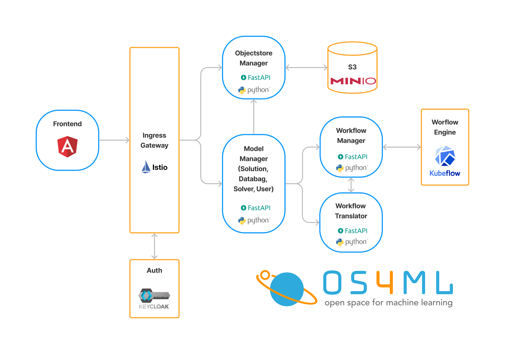

# Architecture
[Os4ML][] is designed as open source cloud-native application which runs on 
[Kubernetes][] clusters. On the one hand it consists of a set of multiple 
python services using [FastAPI][] and an [Angular][] frontend. On the other 
hand it uses standard frameworks for common problems like [Keycloak][] for 
authorization, [Istio][] as ingress gateway, [Mino][] as high performance
object storage and [Kubeflow][] Pipelines as workflow engine. Thus, 
[Os4ML][] benefits from the development performance of a strong open source 
community. This allows us to concentrate on high-level AI solutions.

[Angular]: https://angular.io/
[Istio]: https://github.com/istio/istio
[FastAPI]: https://github.com/tiangolo/fastapi
[Kubernetes]: https://kubernetes.io/
[Kubeflow]: https://www.kubeflow.org/
[Os4ML]: https://github.com/WOGRA-AG/Os4ML
[Keycloak]: https://github.com/keycloak/keycloak
[MinIO]: https://min.io/
[k3s]: https://k3s.io
