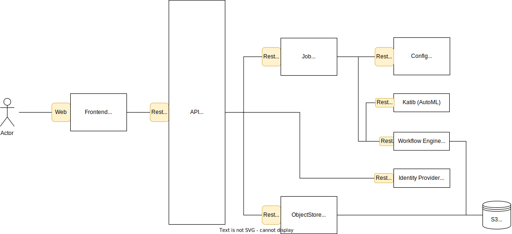

# Design
As already mentioned in the introductory words the project focuses on easy 
installation, intuitive UI/UX and comfortable machine learning. 

In order to achieve this goal with limited resources, [Os4ML][] is based 
on a powerful substructure, more precisely [Kubeflow][]. With Kubeflow 
under the hood, complex machine learning tasks can be performed. Thus, 
[Os4ML][] benefits from the development performance of a strong open source 
community. This allows us to concentrate on high-level ai solutions.

With the choice of [Kubeflow][] as the substructure, the choice of 
[Kubernetes][] as the abstraction layer to the hardware ultimately falls. 
[Os4ML][] and Kubeflow operate in a single Kubernetes cluster in separate 
namespaces.

The Kubernetes cluster serves as an additional abstraction layer during 
installation. The aim is to provide a uniform installation for all 
kubernetes service providers and implementations, such as [k3s][] or 
[MicroK8s][]. For this reason we have decided to use terraform [Terraform][]
. In this way, a terraform module for Kubeflow has already been made 
available as open source [here](https://registry.terraform.io/modules/WOGRA-AG/kubeflow/kustomization/latest). 

Finally, the [Angular][] frontend. A large part of the work will consist of 
providing the user with the power of [Kubeflow][] without requiring AI 
knowledge. In order to support this, a number of other microservices follow,
e.g. an objectstore-manager which allows access to a S3 compatible object 
storage like [MinIO][].

The first tangible demo version awaits you at the end of March 2022. Get 
ready!

[Angular]: https://angular.io/
[Kubernetes]: https://kubernetes.io/
[Kubeflow]: https://www.kubeflow.org/
[Os4ML]: https://github.com/WOGRA-AG/Os4ML
[MicroK8s]: https://microk8s.io/
[MinIO]: https://min.io/
[k3s]: https://k3s.io
[Terraform]: https://www.terraform.io/
